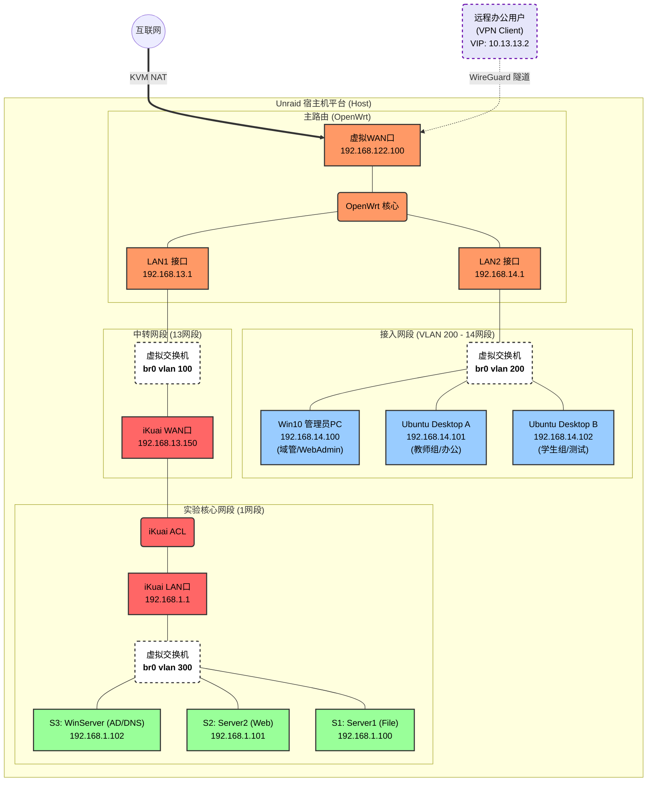

# 内容二：网络拓扑设计

## 1. 设计原则

本方案采用 **"边界 NAT + 核心 ACL"** 的纵深防御架构：

1. **边界路由 (OpenWRT)**：负责 NAT 转换、VPN 接入、客户端上网
2. **核心防火墙 (iKuai)**：保护服务器区，进行二次流量过滤
3. **VLAN 隔离**：客户端区与服务器区逻辑隔离，通过路由策略互访

---

## 2. 拓扑图



---

## 3. 网络区域说明

### 3.1 边界接入区 (OpenWRT)

| 接口 | IP 地址 | 功能 |
|------|---------|------|
| WAN (eth0) | 192.168.122.100 | NAT 出口，连接宿主机 NAT 网络 |
| LAN1 (eth1) | 192.168.13.1 | 连接防火墙 WAN 口 |
| LAN2 (eth2) | 192.168.14.1 | 客户端区网关，提供 DHCP |
| VPN (wg0) | 10.13.13.1 | WireGuard VPN 接口 |

**职责**：
- 处理所有互联网出口流量（NAT）
- 作为客户端区的默认网关
- 提供 VPN 接入服务
- 通过静态路由将访问服务器区的流量转发给防火墙

### 3.2 核心安全区 (iKuai)

| 接口 | IP 地址 | 功能 |
|------|---------|------|
| WAN2 (eth1) | 192.168.13.150 | 上联 OpenWRT |
| LAN1 (eth2) | 192.168.1.1 | 服务器区网关，提供 DHCP |

**职责**：
- 服务器区的唯一入口
- 实施 ACL 访问控制
- 为服务器提供 DHCP 服务（固定分配）

### 3.3 服务器区 (VLAN 300)

| 服务器 | IP 地址 | 服务 |
|--------|---------|------|
| Server1 | 192.168.1.100 | 文件服务 (FTP/SMB/NFS) |
| Server2 | 192.168.1.101 | Web 服务 (Nginx) |
| Server3 | 192.168.1.102 | 域控/DNS (AD DS) |

### 3.4 客户端区 (VLAN 200)

| 客户端 | IP 地址 | 角色 |
|--------|---------|------|
| Client1 | 192.168.14.101 | Ubuntu Desktop (教师) |
| Client2 | 192.168.14.102 | Ubuntu Desktop (学生) |
| Client3 | 192.168.14.100 | Windows 10 (管理员) |

---

## 4. 路由策略

### 4.1 OpenWRT 静态路由

```
目标网段: 192.168.1.0/24
网关: 192.168.13.150
接口: LAN1
```

**作用**：将客户端访问服务器区的流量引流到防火墙

### 4.2 流量路径

```
客户端 (14网段) → OpenWRT (LAN2) → OpenWRT 路由决策
    ├── 目标是互联网 → NAT 转换 → WAN 出口
    └── 目标是 1 网段 → 静态路由 → iKuai (WAN) → iKuai ACL → 服务器区
```

---

## 5. 设计草图

初期设计草图：


